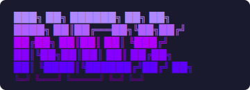

<div align="center">

## Option A: SVG with purple gradient



---

## Option B: HTML pre with color spans

<pre>
<span style="color:#af87ff">███╗   ██╗ ██████╗ ██╗  ██╗</span>
<span style="color:#af5fff">████╗  ██║██╔═══██╗╚██╗██╔╝</span>
<span style="color:#af00ff">██╔██╗ ██║██║   ██║ ╚███╔╝</span>
<span style="color:#8700ff">██║╚██╗██║██║   ██║ ██╔██╗</span>
<span style="color:#5f00ff">██║ ╚████║╚██████╔╝██╔╝ ██╗</span>
<span style="color:#5f0087">╚═╝  ╚═══╝ ╚═════╝ ╚═╝  ╚═╝</span>
</pre>

---

## Option C: Code block (monospace, no color)

```
███╗   ██╗ ██████╗ ██╗  ██╗
████╗  ██║██╔═══██╗╚██╗██╔╝
██╔██╗ ██║██║   ██║ ╚███╔╝
██║╚██╗██║██║   ██║ ██╔██╗
██║ ╚████║╚██████╔╝██╔╝ ██╗
╚═╝  ╚═══╝ ╚═════╝ ╚═╝  ╚═╝
```

</div>

---

**^ TEMPORARY — pick one and we revert ^**