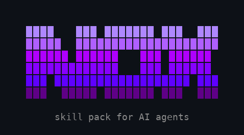

<div align="center">
  
</div>

# Nox

29 battle-tested slash commands for **Claude Code**, **Gemini CLI**, and **Codex CLI**. One install, three CLIs, zero config.

Built for developers running multiple AI agents across terminals, machines, and models — Nox gives every agent the same playbook for code quality, security, deployment, and coordination.

## Why Nox?

- **3-CLI support** — the only skill pack that works across Claude, Gemini, AND Codex
- **Multi-agent coordination** — sync repos between agents, hand off context, run unattended overnight sessions
- **Zero config** — one `bash install.sh`, no API keys, no setup, no dependencies
- **Battle-tested** — born from real multi-machine production systems, not theoretical templates
- **Security-first** — OWASP scanning, secret detection, and env var hygiene baked in
- **Autonomous modes** — `/nox:unloop` and `/nox:iterate` can work while you sleep

---

## Even More Powerful with GSD

Nox is a **standalone** skill pack — every command works on its own, no dependencies required.

But when paired with [**GSD (Get Shit Done)**](https://github.com/get-shit-done-ai/gsd), Nox unlocks automated plan-to-ship pipelines that combine GSD's project management with Nox's quality gates.

**How they work together:**

| | GSD | Nox | Together |
|---|-----|-----|---------|
| **Role** | Project manager | Senior engineer | Full team |
| **Does** | Plans phases, tracks milestones, orchestrates execution | Reviews code, scans security, deploys safely | Automated pipeline from idea to production |
| **Scope** | *What* to build | *How* to build it right | Both — end to end |

**Without GSD:** Every Nox skill works independently. You run `/nox:audit`, `/nox:deploy`, `/nox:security` whenever you need them.

**With GSD:** Two combo skills unlock that chain everything together automatically:

---

## Combo Skills (Nox + GSD)

**`/nox:full-phase`** — Complete plan-to-ship pipeline
> *"Build a Stripe subscription system with full quality gates"*

Automates the entire development lifecycle in one command with 6 blocking quality gates:

```
Plan → Architect → Clarify → Execute → Review → Security → Pentest → Deps → Perf → UX → Commit → Deploy → Verify → Handoff
 GSD      Nox        Nox     GSD+Nox     Nox       Nox        Nox      Nox    Nox   PW     Nox      Nox      GSD       Nox
```

The pipeline pauses for your approval at key decision points:
- After architecture design — "Approve this design?"
- After code review — Critical findings block the pipeline
- After security scan — Critical OWASP findings block the pipeline
- After pentest — Any exploited vulnerability blocks the pipeline
- After deps check — Critical CVEs block the pipeline
- After UX gate — Broken layouts or missing content block the pipeline (Playwright screenshots at desktop + mobile)
- After verification — Failures loop back to fix automatically

Every task inside the pipeline gets TDD enforcement and Playwright visual checks on UI work. Nothing ships without passing all 6 gates.

**`/nox:quick-phase`** — Lightweight plan-to-commit
> *"Add an admin debug panel — skip the ceremony"*

Same structure, minimal overhead. Visual spot-check, advisory review (warns but doesn't block), simplify check, critical CVE scan. No TDD, no security scan, no pentest, no deploy protocol. For internal tools, prototypes, and experiments.

```
Plan → Execute → Visual Check → Review (advisory) → Simplify → Deps (critical only) → Commit → Handoff
```

| | `/nox:full-phase` | `/nox:quick-phase` |
|---|---|---|
| **Use for** | Production features | Prototypes, internal tools |
| **Quality gates** | TDD, review, security, pentest, deps, perf, UX, deploy | Advisory review, visual spot-check, simplify, critical CVE check |
| **Blocking** | 6 gates can block the pipeline | Nothing blocks — warnings only |
| **Speed** | Thorough — 14 steps | Fast — 8 steps |
| **Requires GSD** | Optional (falls back to manual) | Optional |

---

## Quick Install

```bash
git clone https://github.com/LDGUEST/NOX-AI-SKILLS.git
cd NOX-AI-SKILLS
bash install.sh              # Auto-detects installed CLIs
bash install.sh --symlink    # Symlink mode — auto-updates on git pull
```

Install for one CLI only:
```bash
bash install.sh --claude-only
bash install.sh --gemini-only
bash install.sh --codex-only
```

Type `/nox` in Claude Code and all 29 skills appear — same UX as `/gsd`.

## Manual Install

**Claude Code** — copy the `nox/` directory to `~/.claude/commands/`:
```bash
cp -r claude/nox ~/.claude/commands/
```

**Gemini CLI** — copy extension to `~/.gemini/extensions/nox/`:
```bash
cp -r gemini/ ~/.gemini/extensions/nox/
```

**Codex CLI** — copy skills to `~/.agents/skills/`:
```bash
cp -r codex/skills/* ~/.agents/skills/
```

---

## Skill Catalog (29 skills)

### Pipelines

**`/nox:full-phase`** — Complete plan-to-ship pipeline with quality gates
> *"Add user authentication end-to-end"* — Plans, architects, executes with TDD, security scans, deploys, verifies, and captures knowledge. Pauses at decision points.

**`/nox:quick-phase`** — Lightweight plan-to-commit
> *"Scaffold a settings page quickly"* — Plan, build, sanity check, commit. No ceremony.

---

### Code Quality

**`/nox:audit`** — Deep technical audit
> *"Audit this repo before we ship v2"* — Scans for bugs, security holes, dead code, accessibility gaps, and perf bottlenecks. Returns a severity-rated report with file paths and line numbers.

**`/nox:review`** — PR-style code review
> *"Review the changes I made to the auth module"* — Acts as a senior reviewer. Categorizes findings as Critical/Warning/Nit with suggested fixes. Ends with Approve, Request Changes, or Comment.

**`/nox:simplify`** — Kill complexity
> *"Simplify src/utils/ — it's gotten bloated"* — Finds duplication, unnecessary abstractions, dead code, and over-engineering. Proposes concrete simplifications that preserve identical behavior.

**`/nox:refactor`** — Safe refactoring
> *"Refactor the payment module to use the new API client"* — Snapshots current tests, makes incremental changes, verifies after each step. If tests break, reverts automatically.

**`/nox:perf`** — Performance profiling
> *"Why is the dashboard so slow?"* — Profiles frontend (bundle size, re-renders, Core Web Vitals) and backend (N+1 queries, missing indexes, memory leaks). Returns impact estimates with fixes.

**`/nox:deps`** — Dependency health audit
> *"Are any of our packages vulnerable or abandoned?"* — Runs vulnerability scans, finds unused/duplicate packages, checks licenses, flags unmaintained dependencies.

---

### Development Workflow

**`/nox:tdd`** — Test-driven development
> *"Add a discount calculator using TDD"* — Enforces Red-Green-Refactor. Writes failing test first, verifies it fails, writes minimal code to pass, then refactors. No skipping steps.

**`/nox:test`** — Generate tests
> *"Write tests for the user service"* — Auto-detects framework (Jest, Vitest, Pytest, Go test), analyzes code, generates happy path + edge case + error path tests. Targets 80%+ coverage.

**`/nox:commit`** — Smart commit messages
> *"Commit these changes"* — Reads `git diff`, analyzes staged changes, generates a Conventional Commits message focused on WHY not just what. Detects breaking changes.

**`/nox:changelog`** — Generate changelog
> *"Generate a changelog for the v2.0 release"* — Reads git history since last tag, categorizes commits (Added/Changed/Fixed/Security), outputs Keep a Changelog format.

**`/nox:iterate`** — Autonomous execution
> *"Fix all the TypeScript errors in this project"* — Decomposes the goal into steps, executes each one, verifies, self-corrects up to 10 cycles per step. Doesn't stop until done.

---

### Architecture & Planning

**`/nox:architect`** — Design-first gate
> *"I need a real-time notification system"* — Produces component diagram, data flow, API contracts, and tech decisions with tradeoffs. No code until you approve the architecture.

**`/nox:questions`** — Clarify before coding
> *"Build me a dashboard"* — Extracts every question needed to remove ambiguity: data flow, auth, edge cases, integrations, performance requirements. Asks first, builds perfectly once.

**`/nox:landing`** — Landing page generator
> *"Create a landing page for our SaaS product"* — Wireframes layout, writes conversion copy, generates responsive components with animated hero. Adapts to your existing stack.

---

### DevOps & Infrastructure

**`/nox:cicd`** — CI/CD workflow generator
> *"Set up CI for this Next.js project"* — Auto-detects framework, package manager, and test runner. Generates GitHub Actions with caching, linting, testing, matrix builds, and deploy gates.

**`/nox:deploy`** — 5-step deploy protocol
> *"Deploy to production"* — Preflight checks → backup → deploy → verify (HTTP 200, no crashes) → report. Halts immediately if any step fails. Supports Vercel, Netlify, Fly, Railway, SSH.

**`/nox:push`** — Push with safety net
> *"Push these changes"* — Auto-detects platform, pushes to feature branch first, waits for preview deploy, verifies, then merges. Retries up to 3 times on failure.

**`/nox:diagnose`** — System health check
> *"Check if all services are running"* — SSHs into configured machines, checks connectivity, CPU/memory/disk, Docker containers, GPU status, API endpoints. Returns a clean status table.

**`/nox:migrate`** — Database migration generator
> *"Add a status column to the orders table"* — Auto-detects ORM (Prisma, Drizzle, Alembic, Django, Supabase), generates UP + DOWN migrations, warns about destructive operations and table locks.

---

### Security

**`/nox:security`** — OWASP Top 10 scan
> *"Run a security scan before launch"* — Checks all 10 categories: broken access control, injection, XSS, CSRF, auth flaws, vulnerable dependencies, secret exposure, SSRF. Returns findings with severity and remediation steps.

**`/nox:pentest`** — Autonomous penetration test
> *"Pentest this app before we ship"* — 5-phase white-box assessment: code recon, attack surface mapping, vulnerability analysis across 5 categories (injection, XSS, auth, SSRF, authorization), live exploitation with proof-of-concept, and pentester-grade report. No Exploit, No Report — zero false positives.

---

### Multi-Agent & Session Management

**`/nox:syncagents`** — Multi-agent repo sync
> *"Another agent was working on this repo while I was away"* — Detects remote vs local repo, stashes your changes, pulls the other agent's work, rebases, pops stash, handles conflicts.

**`/nox:handoff`** — Knowledge transfer
> *"I'm done for today, capture what we did"* — Summarizes all changes, logs bugs/decisions/patterns, proposes MEMORY.md and DEBUGGING.md entries. The next session starts with full context.

**`/nox:unloop`** — Autonomous overnight repair
> *"Fix everything while I sleep"* — Zero-regression mandate: never break working code to fix something else. 5-minute anti-hang timer. Max 3 pivots before logging a blocker and moving on.

**`/nox:overwrite`** — Context reset
> *"Forget the old API spec — here's the new one"* — Purges stale assumptions and confirms exactly what it's discarding. Essential when switching between agents with conflicting context.

**`/nox:error`** — Shared debugging
> *"Why is this crashing?"* — Checks DEBUGGING.md first (another agent may have solved it). Traces root cause, maps failure chain, provides fix, proposes a DEBUGGING.md entry so it never gets re-investigated.

**`/nox:help-forge`** — Skill catalog
> *"What Nox commands are available?"* — Lists all 29 skills organized by category.

---

## Multi-Agent Management

Nox was built for running multiple AI agents across different terminals, machines, and models. These skills keep your agents coordinated:

| Skill | What it solves |
|-------|---------------|
| `/nox:syncagents` | **Repo sync** — Safely merge work when multiple agents touch the same codebase |
| `/nox:handoff` | **Knowledge transfer** — Captures everything so the next agent starts with full context |
| `/nox:unloop` | **Autonomous operation** — Unattended repair with zero-regression mandate |
| `/nox:iterate` | **Sub-agent orchestration** — Decomposes objectives, self-corrects up to 10 cycles |
| `/nox:overwrite` | **Context reset** — Purges stale assumptions when switching agents or models |
| `/nox:diagnose` | **Cross-machine health** — SSH into any machine and report service status |
| `/nox:error` | **Shared debugging** — Agents share a DEBUGGING.md so bugs are never re-investigated |

**The workflow:** Agent A runs `/nox:handoff` when done → Agent B runs `/nox:syncagents` to pull changes → picks up right where A left off.

---

## Customization

Several skills use environment variables for configuration:

| Variable | Used By | Purpose |
|----------|---------|---------|
| `DEPLOY_CMD` | deploy, push | Custom deploy command |
| `DEPLOY_URL` | deploy, push | Production URL to verify |
| `DEPLOY_BACKUP_CMD` | deploy | Pre-deploy backup command |
| `DEPLOY_HOST` | deploy | SSH deploy target |
| `PROJECT_DIR` | deploy | Remote project directory |
| `FORGE_MACHINES` | diagnose | JSON array of machines to health-check |
| `FORGE_SSH_HOSTS` | unloop | JSON array of SSH hosts for cross-machine ops |

## Structure

```
NOX-AI-SKILLS/
├── README.md
├── LICENSE                    # MIT
├── install.sh                 # Auto-installer (Claude + Gemini + Codex)
├── claude/                    # Claude Code (/nox:<name>)
│   └── nox/
│       └── *.md               # 28 skill files
├── gemini/                    # Gemini CLI
│   ├── gemini-extension.json
│   └── skills/
│       └── <name>/SKILL.md    # 28 skill directories
└── codex/                     # Codex CLI
    └── skills/
        └── <name>/SKILL.md    # 28 skill directories
```

## License

MIT