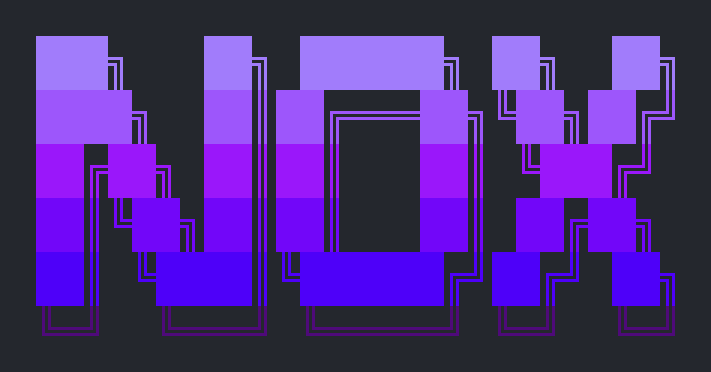

<div align="center">



</div>

<table>
<tr>
<td width="33%" align="center">

### Ship Faster

`/nox:full-phase` runs a complete plan-to-deploy pipeline in one command. Architecture, TDD, security, deploy — done before your coffee gets cold.

</td>
<td width="33%" align="center">

### Catch Everything

6 agents fire in parallel: code review, OWASP security scan, dependency audit, performance profiling, UX testing, and pentest. Any agent can block the merge.

</td>
<td width="33%" align="center">

### Sleep Through It

`/nox:unloop` runs overnight with zero-regression enforcement, 5-min anti-hang timers, and max-pivot guards. Wake up to fixed code, not new bugs.

</td>
</tr>
</table>

# Nox

34 skills + 8 agents + 19 hooks for **Claude Code**, **Gemini CLI**, and **Codex CLI**. One install, three CLIs, zero config.

Built for developers running multiple AI agents across terminals, machines, and models — Nox gives every agent the same playbook for code quality, security, deployment, and coordination.

## Why Nox?

- **3-CLI support** — the only skill pack that works across Claude, Gemini, AND Codex
- **Multi-agent coordination** — sync repos between agents, hand off context, run unattended overnight sessions
- **Zero config** — one `bash install.sh`, no API keys, no setup, no dependencies
- **Battle-tested** — born from real multi-machine production systems, not theoretical templates
- **Security-first** — OWASP scanning, secret detection, and env var hygiene baked in
- **Autonomous modes** — `/nox:unloop` and `/nox:iterate` can work while you sleep

---

## Even More Powerful with GSD

Nox is a **standalone** skill pack — every command works on its own, no dependencies required.

But when paired with [**GSD (Get Shit Done)**](https://github.com/get-shit-done-ai/gsd), Nox unlocks automated plan-to-ship pipelines that combine GSD's project management with Nox's quality gates.

**How they work together:**

| | GSD | Nox | Together |
|---|-----|-----|----------|
| **Role** | Project manager | Senior engineer | Full team |
| **Does** | Plans phases, tracks milestones, orchestrates execution | Reviews code, scans security, deploys safely | Automated pipeline from idea to production |
| **Scope** | *What* to build | *How* to build it right | Both — end to end |

**Without GSD:** Every Nox skill works independently. You run `/nox:audit`, `/nox:deploy`, `/nox:security` whenever you need them. Skills like `audit` now include dependency health, `security` includes pentest mode, and `review` includes complexity checking.

**With GSD:** Two combo skills unlock that chain everything together automatically:

---

## Combo Skills (Nox + GSD)

**`/nox:full-phase`** — Complete plan-to-ship pipeline
> *"Build a Stripe subscription system with full quality gates"*

Automates the entire development lifecycle in one command. After execution completes, **6 quality gate agents dispatch in parallel** — reviewing code, scanning security, auditing dependencies, profiling performance, and screenshotting UX simultaneously:

```
Plan → Architect → Clarify → Execute → ┌─ Review ──┐ → Commit → Deploy → Verify → Handoff
 GSD      Nox        Nox     GSD+Nox    │  Security │     Nox      Nox      GSD       Nox
                                        │  Audit    │
                                        │  Perf     │
                                        └─ UX ──────┘
                                         6 PARALLEL
                                          AGENTS
```

Any agent returning BLOCK stops the pipeline. Fix the issue, re-run only the failed agents. Every task inside execution gets TDD enforcement and Playwright visual checks on UI work. 9 steps, 6 gates, ~80% faster than sequential.

**`/nox:quick-phase`** — Lightweight plan-to-commit
> *"Add an admin debug panel — skip the ceremony"*

Same structure, minimal overhead. Visual spot-check, advisory review (warns but doesn't block), complexity check, critical CVE scan. No TDD, no security scan, no pentest, no deploy protocol. For internal tools, prototypes, and experiments.

```
Plan → Execute → Visual Check → Review (advisory) → Review (complexity) → Audit (critical CVE only) → Commit → Handoff
```

| | `/nox:full-phase` | `/nox:quick-phase` |
|---|---|---|
| **Use for** | Production features | Prototypes, internal tools |
| **Quality gates** | 6 parallel agents (review, security, audit, perf, UX) | Advisory review, visual spot-check, complexity check, critical CVE check |
| **Blocking** | 6 agents can block the pipeline | Nothing blocks — warnings only |
| **Speed** | 9 steps, gates run in parallel | Fast — 8 steps |
| **Requires GSD** | Optional (falls back to manual) | Optional |

---

## Quick Install

**One-liner** (recommended):
```bash
curl -fsSL https://raw.githubusercontent.com/LDGUEST/NOX/main/install.sh | bash
```

**Or clone manually:**
```bash
git clone https://github.com/LDGUEST/NOX.git
cd NOX
bash install.sh              # Auto-detects installed CLIs
bash install.sh --symlink    # Symlink mode — auto-updates on git pull
```

Install for one CLI only:
```bash
bash install.sh --claude-only
bash install.sh --gemini-only
bash install.sh --codex-only
```

Type `/nox` in Claude Code and all 34 skills appear — same UX as `/gsd`.

## Manual Install

**Claude Code** — copy the `nox/` directory to `~/.claude/commands/`:
```bash
cp -r claude/nox ~/.claude/commands/
```

**Gemini CLI** — copy extension to `~/.gemini/extensions/nox/`:
```bash
cp -r gemini/ ~/.gemini/extensions/nox/
```

**Codex CLI** — copy skills to `~/.agents/skills/`:
```bash
cp -r codex/skills/* ~/.agents/skills/
```

---

## Skill Catalog (34 skills)

### Pipelines

**`/nox:full-phase`** — Complete plan-to-ship pipeline with quality gates
> *"Add user authentication end-to-end"* — Plans, architects, executes with TDD, security scans, deploys, verifies, and captures knowledge. Pauses at decision points.

**`/nox:quick-phase`** — Lightweight plan-to-commit
> *"Scaffold a settings page quickly"* — Plan, build, sanity check, commit. No ceremony.

---

### Code Quality

**`/nox:audit`** — Deep technical audit
> *"Audit this repo before we ship v2"* — Scans for bugs, security holes, dead code, accessibility gaps, perf bottlenecks, and dependency health (vulnerabilities, outdated, unused, licenses). Returns a severity-rated report with file paths and line numbers.

**`/nox:review`** — PR-style code review
> *"Review the changes I made to the auth module"* — Acts as a senior reviewer. Categorizes findings as Critical/Warning/Nit with suggested fixes. Includes a complexity check that flags duplication, unnecessary abstractions, dead code, and over-engineering. Ends with Approve, Request Changes, or Comment.

**`/nox:refactor`** — Safe refactoring
> *"Refactor the payment module to use the new API client"* — Snapshots current tests, makes incremental changes, verifies after each step. If tests break, reverts automatically.

**`/nox:perf`** — Performance profiling
> *"Why is the dashboard so slow?"* — Profiles frontend (bundle size, re-renders, Core Web Vitals) and backend (N+1 queries, missing indexes, memory leaks). Returns impact estimates with fixes.

**`/nox:uxtest`** — Comprehensive UX testing
> *"Test the entire frontend before we ship"* — Uses Playwright to run a full UX audit: screenshots at 4 breakpoints (375/768/1280/1920px), interaction testing on every button/form/modal, accessibility scan (Axe), performance snapshot (LCP, CLS, JS errors), and critical user flow simulation. Outputs a structured report with screenshots and pass/fail per flow.

**`/nox:prompt`** — LLM prompt audit
> *"Are our AI prompts production-ready?"* — Finds every LLM prompt in the codebase and audits it across 8 dimensions: clarity, output reliability, cost efficiency, safety/injection resistance, context management, model portability, testability, and maintainability. Calculates per-call and monthly cost estimates, suggests model downgrades where appropriate, and rewrites weak prompts.

---

### Development Workflow

**`/nox:tdd`** — Test-driven development
> *"Add a discount calculator using TDD"* — Enforces Red-Green-Refactor. Writes failing test first, verifies it fails, writes minimal code to pass, then refactors. No skipping steps. Also includes a test generation mode for writing comprehensive tests for existing code.

**`/nox:commit`** — Smart commit messages
> *"Commit these changes"* — Reads `git diff`, analyzes staged changes, generates a Conventional Commits message focused on WHY not just what. Detects breaking changes.

**`/nox:changelog`** — Generate changelog
> *"Generate a changelog for the v2.0 release"* — Reads git history since last tag, categorizes commits (Added/Changed/Fixed/Security), outputs Keep a Changelog format.

**`/nox:iterate`** — Autonomous execution
> *"Fix all the TypeScript errors in this project"* — Decomposes the goal into steps, executes each one, verifies, self-corrects up to 10 cycles per step. Doesn't stop until done.

---

### Architecture & Planning

**`/nox:brainstorm`** — Structured ideation
> *"I need a notification system but I'm not sure how to approach it"* — Forces divergent thinking before convergence. Generates 3+ fundamentally different approaches with architecture sketches, tradeoff analysis, and a weighted evaluation matrix. Recommends one approach with a kill criterion and minimum viable slice. Hands off to `/nox:architect` when ready.

**`/nox:architect`** — Design-first gate
> *"I need a real-time notification system"* — Produces component diagram, data flow, API contracts, and tech decisions with tradeoffs. No code until you approve the architecture.

**`/nox:questions`** — Clarify before coding
> *"Build me a dashboard"* — Extracts every question needed to remove ambiguity: data flow, auth, edge cases, integrations, performance requirements. Asks first, builds perfectly once.

**`/nox:landing`** — Landing page generator
> *"Create a landing page for our SaaS product"* — Wireframes layout, writes conversion copy, generates responsive components with animated hero. Adapts to your existing stack.

---

### DevOps & Infrastructure

**`/nox:cicd`** — CI/CD workflow generator
> *"Set up CI for this Next.js project"* — Auto-detects framework, package manager, and test runner. Generates GitHub Actions with caching, linting, testing, matrix builds, and deploy gates.

**`/nox:deploy`** — 5-step deploy protocol
> *"Deploy to production"* — Preflight checks → backup → deploy → verify (HTTP 200, no crashes) → report. Halts immediately if any step fails. Supports Vercel, Netlify, Fly, Railway, SSH.

**`/nox:push`** — Push with safety net
> *"Push these changes"* — Auto-detects platform, pushes to feature branch first, waits for preview deploy, verifies, then merges. Retries up to 3 times on failure.

**`/nox:diagnose`** — System health check & error investigation
> *"Check if all services are running"* / *"Why is this crashing?"* — SSHs into configured machines, checks connectivity, CPU/memory/disk, Docker containers, GPU status, API endpoints. Returns a clean status table. Also includes error investigation mode: traces root cause, maps failure chain, checks DEBUGGING.md for prior solutions, and proposes entries so bugs are never re-investigated.

**`/nox:monitorlive`** — Real-time log monitoring
> *"Watch the logs while I test this"* — Auto-detects your log source (Vercel, Docker, PM2, systemd, log files), tails in real-time, and surfaces errors, slow requests, auth anomalies, and traffic patterns. Deduplicates noise, correlates incidents, suggests fixes inline.

**`/nox:migrate`** — Database migration generator
> *"Add a status column to the orders table"* — Auto-detects ORM (Prisma, Drizzle, Alembic, Django, Supabase), generates UP + DOWN migrations, warns about destructive operations and table locks.

---

### Security

**`/nox:security`** — OWASP Top 10 scan + pentest
> *"Run a security scan before launch"* / *"Pentest this app before we ship"* — Two modes: **scan mode** checks all 10 OWASP categories (broken access control, injection, XSS, CSRF, auth flaws, vulnerable dependencies, secret exposure, SSRF) with severity and remediation steps. **Pentest mode** runs a 5-phase white-box assessment: code recon, attack surface mapping, vulnerability analysis across 5 categories (injection, XSS, auth, SSRF, authorization), live exploitation with proof-of-concept, and pentester-grade report. No Exploit, No Report — zero false positives.

---

### Multi-Agent & Session Management

**`/nox:syncagents`** — Multi-agent repo sync
> *"Another agent was working on this repo while I was away"* — Detects remote vs local repo, stashes your changes, pulls the other agent's work, rebases, pops stash, handles conflicts.

**`/nox:handoff`** — Knowledge transfer
> *"I'm done for today, capture what we did"* — Summarizes all changes, logs bugs/decisions/patterns, proposes MEMORY.md and DEBUGGING.md entries. The next session starts with full context.

**`/nox:unloop`** — Autonomous overnight repair
> *"Fix everything while I sleep"* — Zero-regression mandate: never break working code to fix something else. 5-minute anti-hang timer. Max 3 pivots before logging a blocker and moving on.

**`/nox:overwrite`** — Context reset
> *"Forget the old API spec — here's the new one"* — Purges stale assumptions and confirms exactly what it's discarding. Essential when switching between agents with conflicting context.

**`/nox:help-forge`** — Skill catalog
> *"What Nox commands are available?"* — Lists all 34 skills organized by category.

**`/nox:skill-create`** — Create new Nox skills
> *"I want to add a new slash command to Nox"* — Meta-skill that scaffolds a new skill in the correct format across all 3 CLIs. Guides you through naming, content structure, registration in help-forge and README, validation checklist, and deployment to all machines. Prevents the most common mistakes (stale counts, missing formats, vague instructions).

**`/nox:guardrails`** — Safety guardrails for all CLIs
> Inline safety checks that mirror Claude Code's 19 hooks for Gemini and Codex users. Destructive command blocking, secret scanning, branch protection, commit linting, drift detection, test regression tracking, and more. Automatically referenced by pipeline and autonomous skills. Claude users get these via hooks; Gemini/Codex users get them via this skill.

---

### Context Engineering

**`/nox:armor`** — File and subsystem protection
> *"Lock down the payment module — agents keep breaking it"* — Adds PROTECTED MODULE headers to code files and NOX-ARMOR comments to context files (CLAUDE.md, MEMORY.md). Gathers context from git history and codebase, writes specific hard rules with real incident references, creates safe-modification protocols in the nearest CLAUDE.md. Works with any language.

**`/nox:context-engineer`** — Context file governance
> *"Audit all my context files across every project"* — Discovers every AI context file (CLAUDE.md, MEMORY.md, DEBUGGING.md, .cursorrules, AGENTS.md, and more) across one or all projects. Scores each project's context health (0-100) on completeness, freshness, accuracy, protection, consistency, and bloat. Enforces armor on unprotected files through interactive questionnaires. Detects cross-project drift, proposes fixes for stale entries, generates missing context files from actual codebase analysis. Replaces the old `/nox:context` skill.

---

## Multi-Agent Management

Nox was built for running multiple AI agents across different terminals, machines, and models. These skills keep your agents coordinated:

| Skill | What it solves |
|-------|---------------|
| `/nox:syncagents` | **Repo sync** — Safely merge work when multiple agents touch the same codebase |
| `/nox:handoff` | **Knowledge transfer** — Captures everything so the next agent starts with full context |
| `/nox:unloop` | **Autonomous operation** — Unattended repair with zero-regression mandate |
| `/nox:iterate` | **Sub-agent orchestration** — Decomposes objectives, self-corrects up to 10 cycles |
| `/nox:overwrite` | **Context reset** — Purges stale assumptions when switching agents or models |
| `/nox:diagnose` | **Cross-machine health + error investigation** — SSH into any machine and report service status; also traces root cause with shared DEBUGGING.md so bugs are never re-investigated |

**The workflow:** Agent A runs `/nox:handoff` when done → Agent B runs `/nox:syncagents` to pull changes → picks up right where A left off.

---

## Agents (8)

Nox includes 8 specialized subagents that power the parallel quality gates in `/nox:full-phase`. Each agent is a standalone `.md` file installed to `~/.claude/agents/`.

| Agent | Role | Verdict |
|-------|------|---------|
| `nox-reviewer` | Cross-file code review — correctness, security, performance, design, tests | APPROVE / REQUEST_CHANGES / COMMENT |
| `nox-security-scanner` | OWASP Top 10 static analysis with CWE references and remediation | PASS / WARN / BLOCK |
| `nox-pentester` | Live exploitation — 5-phase white-box pentest with proof-of-concept | PASS / WARN / BLOCK |
| `nox-dep-auditor` | CVE detection, outdated packages, license compliance, supply chain risk | PASS / WARN / BLOCK |
| `nox-perf-profiler` | N+1 queries, bundle size, memory leaks, Core Web Vitals, rendering | PASS / WARN / BLOCK |
| `nox-ux-tester` | Playwright screenshots at 4 breakpoints, interaction testing, Axe accessibility | PASS / WARN / BLOCK |
| `nox-prompt-auditor` | LLM prompt audit across 8 dimensions with cost calculation | PASS / WARN / BLOCK |
| `nox-monitor` | Background log monitoring with deduplication, correlation, anomaly detection | Continuous |

In `/nox:full-phase`, 6 of these agents (all except prompt-auditor and monitor) dispatch **simultaneously** after code execution completes. This parallel dispatch cuts gate time by ~80% compared to running them sequentially.

`nox-prompt-auditor` and `nox-monitor` are standalone — use them independently when auditing AI prompts or monitoring live logs.

---

## Hooks (19)

Opt-in Claude Code hooks that provide continuous passive protection across ALL Nox and GSD workflows. Install with `bash install.sh --with-hooks`.

19 hooks across **8 hook events** — the most comprehensive hook suite available for Claude Code.

### Safety & Protection

| Hook | Event | What It Does |
|------|-------|-------------|
| `destructive-guard` | PreToolUse (Bash) | Blocks `rm -rf`, `git reset --hard`, force push, DROP TABLE |
| `sync-guard` | PreToolUse (Edit\|Write) | Warns if unstaged changes exist (multi-agent collision prevention) |
| `secret-scanner` | PostToolUse (Write\|Edit) | Scans for leaked API keys, JWTs, AWS/Stripe/GitHub tokens |
| `file-size-guard` | PreToolUse (Write) | Blocks writing files over 500KB — catches base64 dumps, minified bundles |
| `prompt-guard` | UserPromptSubmit | Warns on vague/destructive prompts ("delete everything", "rewrite all") |

### Quality & Regression

| Hook | Event | What It Does |
|------|-------|-------------|
| `commit-lint` | PreToolUse (Bash) | Validates commit messages follow Conventional Commits (`feat:`, `fix:`, etc.) |
| `test-regression-guard` | PostToolUse (Bash) | Tracks test pass/fail counts, warns when failures increase |
| `build-tracker` | PostToolUse (Bash) | Tracks build warning/error counts, alerts on increase |
| `drift-detector` | PostToolUse (Write\|Edit) | Tracks cumulative lines changed, warns at 100/500 lines to encourage commits |
| `todo-tracker` | PostToolUse (Write\|Edit) | Detects new TODO/FIXME/HACK comments, logs them for tracking |

### Awareness & Context

| Hook | Event | What It Does |
|------|-------|-------------|
| `auto-context` | SessionStart | Injects git branch, recent commits, TODO count, DEBUGGING.md highlights on every session start |
| `debug-reminder` | PostToolUse (Bash) | On failure: "check DEBUGGING.md before re-investigating" |
| `compact-saver` | PreCompact | Saves a context checkpoint before compaction — branch, diff, recent files |
| `memory-auto-save` | Stop | Reminds if bugs were fixed but DEBUGGING.md/MEMORY.md weren't updated |

### Monitoring & Alerts

| Hook | Event | What It Does |
|------|-------|-------------|
| `cost-alert` | PostToolUse (all) | Warns when session cost exceeds threshold (every 20 tool calls) |
| `notify-complete` | PostToolUse (Bash) | Desktop notification when commands take >60s (macOS/Linux) |
| `agent-tracker` | SubagentStart | Tracks subagent spawns, alerts on runaway loops (>10 agents) |
| `session-logger` | Stop | Logs session summaries — project, branch, files changed — for work history |

**Two-Layer Defense:** Hooks (Layer 1) run passively on every tool call. Agents (Layer 2) run at pipeline checkpoints. Together they catch issues both as they happen and in aggregate.

```
Layer 1 (Hooks)  ─── continuous ──── every tool call ──── catches issues in real-time
Layer 2 (Agents) ─── checkpoint ──── Step 5 of pipeline ── deep analysis on all changes
```

Especially critical during autonomous execution (`/nox:iterate`, `/nox:unloop`) where no human is watching.

**Configuration:**

| Variable | Default | Purpose |
|----------|---------|---------|
| `NOX_COST_THRESHOLD` | `15` | Dollar amount before cost alert fires |
| `NOX_COST_CHECK_INTERVAL` | `20` | Check cost every N tool calls |
| `NOX_NOTIFY_THRESHOLD` | `60` | Seconds before command completion notification |
| `NOX_ALLOW_DESTRUCTIVE` | `0` | Set to `1` to disable destructive guard |
| `NOX_SECRET_PATTERNS` | — | Path to file with custom secret regex patterns |
| `NOX_COMMIT_TYPES` | `feat\|fix\|chore\|...` | Allowed Conventional Commit types |
| `NOX_FILE_SIZE_LIMIT` | `512000` | Max file size in bytes (500KB) |
| `NOX_DRIFT_WARN` | `100` | Lines changed before first drift warning |
| `NOX_DRIFT_ALERT` | `500` | Lines changed before escalated drift alert |
| `NOX_AGENT_LIMIT` | `10` | Max subagents before runaway loop warning |
| `NOX_SKIP_*` | — | Set any `NOX_SKIP_<HOOK_NAME>=1` to disable individually |

<details>
<summary>Settings.json configuration (click to expand)</summary>

Add this to your `~/.claude/settings.json` under `"hooks"`:

```json
{
  "hooks": {
    "SessionStart": [
      {
        "hooks": [
          {"type": "command", "command": "bash ~/.claude/hooks/auto-context.sh"}
        ]
      }
    ],
    "UserPromptSubmit": [
      {
        "hooks": [
          {"type": "command", "command": "bash ~/.claude/hooks/prompt-guard.sh"}
        ]
      }
    ],
    "PreToolUse": [
      {
        "matcher": "Edit|Write",
        "hooks": [
          {"type": "command", "command": "bash ~/.claude/hooks/sync-guard.sh"}
        ]
      },
      {
        "matcher": "Write",
        "hooks": [
          {"type": "command", "command": "bash ~/.claude/hooks/file-size-guard.sh"}
        ]
      },
      {
        "matcher": "Bash",
        "hooks": [
          {"type": "command", "command": "bash ~/.claude/hooks/destructive-guard.sh"},
          {"type": "command", "command": "bash ~/.claude/hooks/commit-lint.sh"},
          {"type": "command", "command": "bash ~/.claude/hooks/notify-timer-start.sh"}
        ]
      }
    ],
    "PostToolUse": [
      {
        "hooks": [
          {"type": "command", "command": "bash ~/.claude/hooks/cost-alert.sh"}
        ]
      },
      {
        "matcher": "Write|Edit",
        "hooks": [
          {"type": "command", "command": "bash ~/.claude/hooks/secret-scanner.sh"},
          {"type": "command", "command": "bash ~/.claude/hooks/todo-tracker.sh"},
          {"type": "command", "command": "bash ~/.claude/hooks/drift-detector.sh"}
        ]
      },
      {
        "matcher": "Bash",
        "hooks": [
          {"type": "command", "command": "bash ~/.claude/hooks/debug-reminder.sh"},
          {"type": "command", "command": "bash ~/.claude/hooks/build-tracker.sh"},
          {"type": "command", "command": "bash ~/.claude/hooks/test-regression-guard.sh"},
          {"type": "command", "command": "bash ~/.claude/hooks/notify-complete.sh"}
        ]
      }
    ],
    "SubagentStart": [
      {
        "hooks": [
          {"type": "command", "command": "bash ~/.claude/hooks/agent-tracker.sh"}
        ]
      }
    ],
    "PreCompact": [
      {
        "hooks": [
          {"type": "command", "command": "bash ~/.claude/hooks/compact-saver.sh"}
        ]
      }
    ],
    "Stop": [
      {
        "hooks": [
          {"type": "command", "command": "bash ~/.claude/hooks/session-logger.sh"},
          {"type": "command", "command": "bash ~/.claude/hooks/memory-auto-save.sh"}
        ]
      }
    ]
  }
}
```
</details>

---

## Customization

Several skills use environment variables for configuration:

| Variable | Used By | Purpose |
|----------|---------|----------|
| `DEPLOY_CMD` | deploy, push | Custom deploy command |
| `DEPLOY_URL` | deploy, push | Production URL to verify |
| `DEPLOY_BACKUP_CMD` | deploy | Pre-deploy backup command |
| `DEPLOY_HOST` | deploy | SSH deploy target |
| `PROJECT_DIR` | deploy | Remote project directory |
| `FORGE_MACHINES` | diagnose | JSON array of machines to health-check |
| `FORGE_SSH_HOSTS` | unloop | JSON array of SSH hosts for cross-machine ops |

## MCP Server

Nox includes an MCP server that exposes all skills to any MCP-compatible client (Claude Desktop, Cursor, Windsurf, etc.). The installer auto-registers it in `~/.claude/.mcp.json`.

**3 tools:**
| Tool | Description |
|------|-------------|
| `nox_list` | Returns the full skill catalog |
| `nox_skill` | Returns a skill's instructions for the LLM to follow (accepts `skill_name`, optional `mode` and `target`) |
| `nox_agent` | Returns an agent definition |

Skills and agents are discovered dynamically from the filesystem — no hardcoded lists.

**Manual setup** (if auto-registration didn't work):
```json
// ~/.claude/.mcp.json
{
  "mcpServers": {
    "nox": {
      "command": "node",
      "args": ["/path/to/NOX/mcp-server/server.js"]
    }
  }
}
```

Requires Node.js. Dependencies install automatically during `bash install.sh`.

---

## Structure

```
NOX/
├── README.md
├── LICENSE                    # MIT
├── install.sh                 # Auto-installer (Claude + Gemini + Codex + Agents + Hooks)
├── hooks/                     # Claude Code hooks (opt-in with --with-hooks)
│   ├── auto-context.sh        # SessionStart: inject project state
│   ├── prompt-guard.sh        # UserPromptSubmit: warn on vague/destructive prompts
│   ├── destructive-guard.sh   # PreToolUse: block dangerous commands
│   ├── commit-lint.sh         # PreToolUse: enforce Conventional Commits
│   ├── file-size-guard.sh     # PreToolUse: block oversized file writes
│   ├── sync-guard.sh          # PreToolUse: multi-agent collision warning
│   ├── secret-scanner.sh      # PostToolUse: leaked secret detection
│   ├── todo-tracker.sh        # PostToolUse: track new TODOs
│   ├── drift-detector.sh      # PostToolUse: warn on large uncommitted diffs
│   ├── test-regression-guard.sh # PostToolUse: detect test regressions
│   ├── build-tracker.sh       # PostToolUse: build health tracking
│   ├── debug-reminder.sh      # PostToolUse: DEBUGGING.md auto-check
│   ├── cost-alert.sh          # PostToolUse: session cost threshold
│   ├── notify-complete.sh     # PostToolUse: desktop notification (>60s)
│   ├── notify-timer-start.sh  # PreToolUse: timer for notify-complete
│   ├── agent-tracker.sh       # SubagentStart: runaway loop detection
│   ├── compact-saver.sh       # PreCompact: save context checkpoint
│   ├── session-logger.sh      # Stop: log session summary
│   └── memory-auto-save.sh    # Stop: remind to update DEBUGGING.md
├── mcp-server/                # MCP server (any MCP-compatible client)
│   ├── package.json
│   └── server.js              # 3 tools: nox_list, nox_skill, nox_agent
├── agents/                    # Subagents for parallel quality gates
│   └── nox-*.md               # 8 agent definitions
├── claude/                    # Claude Code (/nox:<name>)
│   └── nox/
│       └── *.md               # 34 skill files
├── gemini/                    # Gemini CLI
│   ├── gemini-extension.json
│   └── skills/
│       └── <name>/SKILL.md    # 34 skill directories
└── codex/                     # Codex CLI
    └── skills/
        └── <name>/SKILL.md    # 31 skill directories
```

## License

MIT